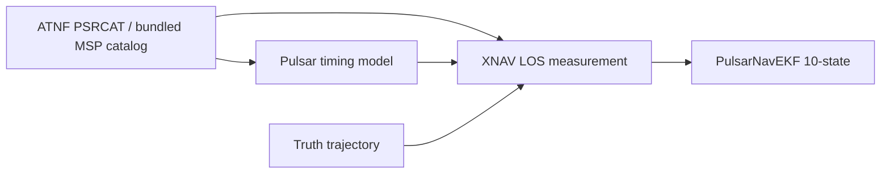

# Pulsar Hybrid Navigation (AA278)

Pulsar-only XNAV framework for **Pulsar Hybrid Navigation for the Lunar Far Side** (Tanis Priddle, AA278). This repo implements Week 7 deliverables first: pulsar catalog, LOS measurement model, and EKF — before LunaNet hybrid fusion and full lunar ODTS propagation.

## Architecture



**Measurement model** (Sheikh & Pines, linearized; see pitch): scalar range along line-of-sight,

\[
z = \hat{\mathbf{n}} \cdot \mathbf{r} + \nu,\quad \sigma_z = c\,\sigma_{\mathrm{TOA}}
\]

## Data sources

| Source | Role |
|--------|------|
| [ATNF Pulsar Catalogue](https://www.atnf.csiro.au/research/pulsar/psrcat/) | MSP ephemerides (F0, F1, RAJ, DecJ) |
| Bundled `data/catalog/sextant_msp.json` | SEXTANT/NICER navigation pulsar set (offline fallback) |
| [NICER / SEXTANT](https://heasarc.gsfc.nasa.gov/docs/nicer/) | TOA noise targets, on-orbit XNAV reference |
| [NAIF generic kernels](https://naif.jpl.nasa.gov/pub/naif/generic_kernels/) | SPICE frames/time (next: truth propagation) |
| `HW2/data/brdc_data.npz` | GPS broadcast ephemeris (RINEX nav, HW2 P3) |
| [CelesTrak GP](https://celestrak.org/NORAD/elements/) | Optional TLE fetch; default LunaNet uses Walker model |
| [poliastro](./poliastro/) | Orbit propagation (lunar ELFO/LLO, later) |

## Setup

```bash
cd /Users/tanispriddle/Downloads/278proj
python3 -m venv .venv
source .venv/bin/activate
pip install -e ".[dev]"
# Optional: SPICE + poliastro for full simulator
pip install spiceypy
pip install -e ./poliastro
```

## SPICE kernels

Copy NAIF generic kernels into `data/kernels/` (or set `PULSAR_NAV_KERNEL_DIR`):

- `naif0012.tls`, `de440.bsp` from [generic_kernels/lsk](https://naif.jpl.nasa.gov/pub/naif/generic_kernels/lsk/) and [spk](https://naif.jpl.nasa.gov/pub/naif/generic_kernels/spk/)
- `moon_pa_de440_200625.bpc`, `moon_de440_250416.tf` from [pck](https://naif.jpl.nasa.gov/pub/naif/generic_kernels/pck/) and [fk](https://naif.jpl.nasa.gov/pub/naif/generic_kernels/fk/)

If you completed AA278 HW2, the course `AA278/HW2/data/` folder already has these files and is searched automatically.

**GPS broadcast (GNSS sidelobe):** copy `brdc_data.npz`, `earth_assoc_itrf93.tf`, and `earth_latest_high_prec.bpc` into `HW2/data/` (included in the course HW2 bundle). Hybrid demos call `load_kernels(load_gps_frames=True)`.

## Quick start

```bash
pip install -e ".[dev,spice]"

# Lunar ELFO truth propagation (scipy + SPICE)
pip install -e ".[viz]"
python scripts/demo_propagate_elo.py          # prints stats + opens plots
python scripts/demo_propagate_visualize.py --preset elfo --no-show  # save PNGs only
python scripts/demo_propagate_visualize.py --preset llo --duration 2

# Single-pulsar EKF geometry check
python scripts/demo_single_pulsar.py

# Multi-pulsar batch + EKF
python scripts/demo_multi_pulsar.py

# XNAV EKF on propagated ELFO/LLO truth (Week 7 integration)
python scripts/demo_xnav_with_truth.py --preset elfo --duration 6 --no-show

# GNSS blackout + LunaNet visibility on ELFO (30 hr orbit)
python scripts/demo_blackout_elo.py --preset elfo --duration 30 --no-show

# Validate visibility vs lecture anchors (GNSS PRN count, orbit phase, LunaNet)
python scripts/validate_visibility_anchors.py --preset elfo --duration 30

# Hybrid EKF: XNAV always + GNSS/LunaNet when visible (Week 8)
python scripts/demo_hybrid_elo.py --preset elfo --duration 6 --no-show

# Monte Carlo: xnav_only vs gnss_only vs hybrid switching (Week 9)
# Defaults: 2× ELFO period (~26.4 hr), TOA σ = 1 µs
python scripts/demo_monte_carlo.py --trials 20 --no-show
python scripts/demo_monte_carlo.py --sweep-toa --trials 20 --no-show  # include 0.1 µs
# Tables: docs/MONTE_CARLO_RESULTS.md  (see docs/SIMULATION_LIMITATIONS.md for what is realistic)

# Presentation bundle: common/ + truth_velocity/ + filter_predict/ figures
python scripts/build_presentation_assets.py          # see docs/PRESENTATION.md
python scripts/build_presentation_assets.py --pipelines filter_predict  # EKF-only predict

pytest
```

## Package layout

```
src/pulsar_nav/
  catalog/      # PSRCAT + bundled SEXTANT MSPs
  measurements/ # XNAV LOS + GNSS/LunaNet pseudorange
  filter/       # 10-state EKF (XNAV + pseudorange updates)
  spice/        # kernel loading, Earth/Sun ephemeris, ICRS transforms
  propagation/  # lunar dynamics + scipy/poliastro propagators
  visibility/   # GNSS Earth mask, LunaNet Walker, blackout windows
  simulation/   # truth, hybrid EKF, Monte Carlo campaigns
  visualization/# orbit, nav error, visibility plots
```

## Roadmap (from pitch)

1. **Done** — XNAV-only: catalog, measurement model, EKF, single/multi-pulsar validation
2. **Done** — Truth propagator: Moon-centered dynamics (Earth/Sun third-body), SPICE ephemeris, ELFO/LLO presets
3. **Done** — Visibility: Earth elevation GNSS mask, LunaNet Walker relays, blackout windows
4. **Done** — LunaNet/GNSS pseudorange model, hybrid EKF (`NavMode` from visibility timeline)
5. **Done** — Monte Carlo: policy comparison, pulsar-count / TOA sweeps, LunaNet 13.43 m ref
6. **Next** — High-order lunar gravity; replay HW2 `gnss_measurements.pkl`; CelesTrak TLE for LunaNet

## References

- Sheikh & Pines (2006), *Spacecraft Navigation Using X-Ray Pulsars*
- [NICER/SEXTANT](https://heasarc.gsfc.nasa.gov/docs/nicer/) on-orbit demonstration
- Chen et al. (2025) pulsar selection / TOA noise
- Pitch: `AA 278 Pitch.pdf`
