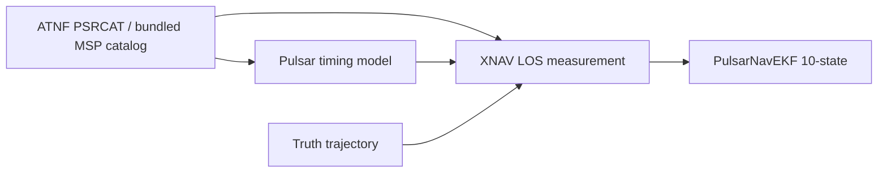

# Pulsar Hybrid Navigation (AA278)

Pulsar-only XNAV framework for **Pulsar Hybrid Navigation for the Lunar Far Side** (Tanis Priddle, AA278). This repo implements Week 7 deliverables first: pulsar catalog, LOS measurement model, and EKF - before LunaNet hybrid fusion and full lunar ODTS propagation.

## Architecture



**Measurement model** (Sheikh & Pines, linearized; see pitch): scalar range along line-of-sight,

```
z = n_hat dot r + nu
sigma_z = c * sigma_TOA
```

## Data sources

| Source | Role |
|--------|------|
| [ATNF Pulsar Catalogue](https://www.atnf.csiro.au/research/pulsar/psrcat/) | MSP ephemerides (F0, F1, RAJ, DecJ) |
| Bundled `data/catalog/sextant_msp.json` | SEXTANT/NICER navigation pulsar set (offline fallback) |
| [NICER / SEXTANT](https://heasarc.gsfc.nasa.gov/docs/nicer/) | TOA noise targets, on-orbit XNAV reference |
| [NAIF generic kernels](https://naif.jpl.nasa.gov/pub/naif/generic_kernels/) | SPICE frames/time (next: truth propagation) |
| `HW2/data/brdc_data.npz` | GPS broadcast ephemeris (RINEX nav, HW2 P3) |
| [CelesTrak GP](https://celestrak.org/NORAD/elements/) | Optional TLE fetch; default LunaNet uses Walker model |
| [poliastro](./poliastro/) | Orbit propagation (lunar ELFO/LLO, later) |

## Setup

```bash
cd /Users/tanispriddle/Downloads/278proj
python3 -m venv .venv
source .venv/bin/activate
pip install -e ".[dev]"
# Optional: SPICE + poliastro for full simulator
pip install spiceypy
pip install -e ./poliastro
```

## SPICE kernels

Copy NAIF generic kernels into `data/kernels/` (or set `PULSAR_NAV_KERNEL_DIR`):

- `naif0012.tls`, `de440.bsp` from [generic_kernels/lsk](https://naif.jpl.nasa.gov/pub/naif/generic_kernels/lsk/) and [spk](https://naif.jpl.nasa.gov/pub/naif/generic_kernels/spk/)
- `moon_pa_de440_200625.bpc`, `moon_de440_250416.tf` from [pck](https://naif.jpl.nasa.gov/pub/naif/generic_kernels/pck/) and [fk](https://naif.jpl.nasa.gov/pub/naif/generic_kernels/fk/)

If you completed AA278 HW2, the course `AA278/HW2/data/` folder already has these files and is searched automatically.

**GPS broadcast (GNSS sidelobe):** copy `brdc_data.npz`, `earth_assoc_itrf93.tf`, and `earth_latest_high_prec.bpc` into `HW2/data/` (included in the course HW2 bundle). Hybrid runs call `load_kernels(load_gps_frames=True)`.

## Quick start

```bash
pip install -e ".[dev,spice,viz]"

# Full presentation bundle (geometry + filter_dynamics MC + predict-mode comparison)
python scripts/build_presentation_assets.py
# Primary campaign only (skip truth_velocity / filter_predict comparison MC):
python scripts/build_presentation_assets.py --pipelines filter_dynamics --no-compare
# Refresh INDEX / timing / q_sweep from existing CSVs (no MC):
python scripts/refresh_presentation_manifest.py

# Diagnostics & tuning
python scripts/check_nis.py --filter-predict
python scripts/sweep_process_noise.py --dynamics-predict --trials 10
python scripts/verify_pipeline.py

pytest
```

**Asset index:** [presentation/INDEX.md](presentation/INDEX.md) | slide notes: [docs/PRESENTATION.md](docs/PRESENTATION.md)

Predict modes (`truth_velocity`, `filter_predict`, `filter_dynamics`) remain in code; only **filter_dynamics** has full figures/tables. Cross-mode stats live in `presentation/tables/common/predict_mode_comparison.md`.

## Package layout

```
src/pulsar_nav/
 catalog/ # PSRCAT + bundled SEXTANT MSPs
 measurements/ # XNAV LOS + GNSS/LunaNet pseudorange
 filter/ # 10-state EKF (XNAV + pseudorange updates)
 spice/ # kernel loading, Earth/Sun ephemeris, ICRS transforms
 propagation/ # lunar dynamics + scipy/poliastro propagators
 visibility/ # GNSS Earth mask, LunaNet Walker, blackout windows
 simulation/ # truth, hybrid EKF, Monte Carlo campaigns
 visualization/# orbit, nav error, visibility plots
```

## Roadmap (from pitch)

1. **Done** - XNAV-only: catalog, measurement model, EKF, single/multi-pulsar validation
2. **Done** - Truth propagator: Moon-centered dynamics (Earth/Sun third-body), SPICE ephemeris, ELFO/LLO presets
3. **Done** - Visibility: Earth elevation GNSS mask, LunaNet Walker relays, blackout windows
4. **Done** - LunaNet/GNSS pseudorange model, hybrid EKF (`NavMode` from visibility timeline)
5. **Done** - Monte Carlo: policy comparison, pulsar-count / TOA sweeps, LunaNet 13.43 m ref
6. **Next** - High-order lunar gravity; replay HW2 `gnss_measurements.pkl`; CelesTrak TLE for LunaNet

## References

- Sheikh & Pines (2006), *Spacecraft Navigation Using X-Ray Pulsars*
- [NICER/SEXTANT](https://heasarc.gsfc.nasa.gov/docs/nicer/) on-orbit demonstration
- Chen et al. (2025) pulsar selection / TOA noise
