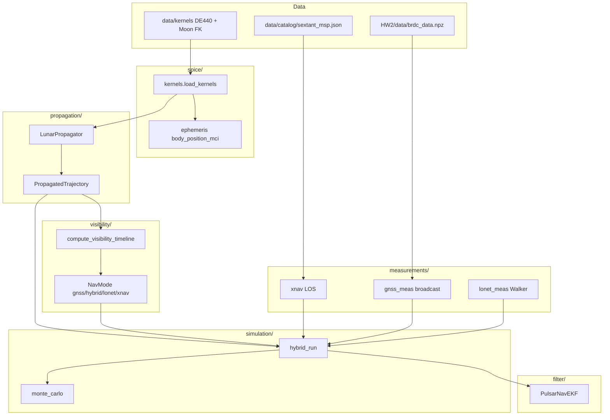

# Repository architecture

Pulsar Hybrid Navigation for the lunar far side (AA278): truth orbit → visibility → measurements → EKF → Monte Carlo.

---

## End-to-end data flow



---

## State vector and frames

| Quantity | Frame | Units in filter |
|----------|--------|-----------------|
| Truth propagation | MCI (Moon-centered J2000) | km, km/s |
| Truth export for nav | ICRS | m, m/s |
| EKF state **r**, **v** | ICRS | m, m/s |
| Pseudorange geometry | MCI for ρ, Jacobian maps to ICRS **r** | m |
| Pulsar LOS | ICRS unit vector n̂ | dimensionless |

**10-state vector** (`filter/state.py`):

\[
\mathbf{x} = [\mathbf{r}_{ICRS},\ \mathbf{v}_{ICRS},\ b_{rx},\ \dot b_{rx},\ s_8,\ s_9]^T
\]

- \(b_{rx}\): receiver clock bias (meters)
- \(\dot b_{rx}\): clock drift (m/s)
- \(s_8, s_9\): spare (unused in measurements)

---

## Mathematics by layer

### Truth dynamics (`propagation/dynamics.py`)

Moon-centered specific force (km/s²):

\[
\mathbf{a} = -\mu_m \frac{\mathbf{r}}{\|\mathbf{r}\|^3}
+ \sum_{b \in \{E,S\}} -\mu_b\left(\frac{\mathbf{r}-\mathbf{r}_b}{\|\mathbf{r}-\mathbf{r}_b\|^3} + \frac{\mathbf{r}_b}{\|\mathbf{r}_b\|^3}\right)
\]

Optional: Moon J2, solar radiation pressure. Integrated with `scipy.integrate.solve_ivp` (`propagator.py`). Earth/Sun positions from SPICE DE440.

**Initial state:** HW2 frozen-orbit COE are defined in the Earth orbital-plane (OP) frame. `mci_to_op_rotation` (HW2 P2.3) maps OP → MCI via block-diagonal rotation built from Earth `r×v` and the lunar pole — not `MOON_PA` `sxform` (see `spice/ephemeris.py`).

**ICRS truth position:**

\[
\mathbf{r}_{ICRS} = \mathbf{r}_{MCI} + \mathbf{r}_{Moon/SSB}(t)
\]

(Implemented in propagator loop using `moon_position_icrs_km`.)

### XNAV (`measurements/xnav.py`)

Linearized pulsar observable (Sheikh):

\[
z_k = \hat{\mathbf{n}}_k \cdot \mathbf{r} + \nu_k,\quad \sigma_{z,k} = c\,\sigma_{TOA}
\]

Jacobian row: \(H_k = [\hat{\mathbf{n}}_k^T,\ \mathbf{0},\ 0,\ \ldots]\).

### GNSS pseudorange (`measurements/pseudorange.py`)

\[
\rho = \|\mathbf{r}_{rx} - \mathbf{r}_{tx}(t_{tx})\| + b_{rx} - b_{tx}
\]

Light-time: iterate \(t_{tx} \leftarrow t_{rx} - \|\mathbf{r}_{rx}-\mathbf{r}_{tx}\|/c\) (3×).  
Jacobian: \(H_\rho = [(\mathbf{r}_{rx}-\mathbf{r}_{tx})/\|\cdot\|]^T\) (ICRS chain), \(H_{b_{rx}}=1\).

GPS \(\mathbf{r}_{tx}\): broadcast Keplerian ECEF → ITRF93→J2000 → + Earth MCI (`ephemeris/gps_posclk.py`).

### EKF (`filter/ekf.py`)

**Predict** (constant velocity + clock):

\[
\mathbf{r}_{k+1} = \mathbf{r}_k + \mathbf{v}_k \Delta t,\quad
b_{k+1} = b_k + \dot b_k \Delta t
\]

\[
\mathbf{x}_{k+1|k} = \Phi \mathbf{x}_{k|k},\quad
P_{k+1|k} = \Phi P_{k|k} \Phi^T + Q
\]

**Update** (stacked measurements at one epoch):

\[
\mathbf{y} = \mathbf{z} - h(\mathbf{x}),\quad
S = HPH^T + R,\quad
K = PH^T S^{-1},\quad
\mathbf{x} \leftarrow \mathbf{x} + K\mathbf{y},\quad
P \leftarrow (I-KH)P
\]

`update_navigation_epoch` stacks XNAV + all pseudoranges in one \(H,R\) (avoids sequential over-weighting).

### Visibility (`visibility/blackout.py`)

- **Blackout (timeline):** `in_blackout = not gnss_earth_visible` — Earth below 5° elevation mask. This is a **geometric upper bound** on sidelobe availability (~40–75% on a 6 hr HW2 ELFO at the project epoch), not trackable PRN count.
- **Trackable GPS (filter):** `visible_gps_prns` / `gps_sidelobe_limb_deg`: clear far-side SC→GPS line (not Earth-occulted, GPS farther than Earth), near-limb annulus (~≤6°), cap 4 PRNs. Does not model antenna gain or C/N₀; HW2 `gnss_measurements.pkl` is the course ground truth when available.
- **LunaNet:** Walker relays at 8000 km; default 16 sats. Lecture anchors ~40–55% GDOP < 6 for small relay sets — validate with `scripts/validate_visibility_anchors.py`.
- **NavMode:** GNSS / HYBRID / LONET / XNAV from GNSS + LunaNet flags.
- **NavPolicy** (`simulation/policy.py`): switching measurement stacks — `xnav_only` (pulsars all arc), `gnss_only` (GNSS when not in blackout, pulsars in blackout), `hybrid` (GNSS+LunaNet when not in blackout, pulsars in blackout). `NavMode` is geometry-only for plots.

---

## Package: `src/pulsar_nav/`

### `constants.py`
Speed of light, MJD constants, default TOA σ. Used everywhere measurements convert time ↔ range.

### `catalog/`
| File | Role | Called by |
|------|------|-----------|
| `pulsar.py` | `Pulsar` dataclass: n̂ from RAJ/DecJ, \(z=\hat n\cdot r\), phase model | xnav, hybrid_run, monte_carlo, demos |
| `psrcat.py` | HTTP PSRCAT + fallback to bundled JSON | `load_catalog()` |
| `__init__.py` | `load_catalog()`, `load_bundled_catalog()` | All nav demos/tests |

**Data:** `data/catalog/sextant_msp.json` — 5 SEXTANT MSPs.

### `frames/icrs.py`
HMS/DMS → radians; `unit_vector_icrs(raj, decj)`. Called by `Pulsar.unit_vector_icrs`.

### `timing/model.py`
Phase \(\phi = f_0 \Delta t + \frac{1}{2} f_1 \Delta t^2\); TOA residual \(\delta t \approx (\hat n\cdot \delta r)/c\). Not on the main EKF path (XNAV uses range directly); for future barycentric TOA.

### `spice/`
| File | Role | Called by |
|------|------|-----------|
| `kernels.py` | Load `naif0012.tls`, `de440.bsp`, Moon PCK/TF; optional Earth frames for GPS | All SPICE demos, propagator, monte_carlo |
| `ephemeris.py` | `str_to_et`, `body_position_mci`, `moon_position_icrs_km`, `mci_to_icrs_position` | dynamics, propagator, pseudorange, visibility, gnss |

### `ephemeris/` (GPS broadcast)
| File | Role | Called by |
|------|------|-----------|
| `paths.py` | Find `brdc_data.npz`, Earth kernel paths | broadcast, kernels |
| `broadcast.py` | Wrap HW2 `Ephemeris` class (Keplerian nav from RINEX) | gps_posclk |
| `gps_posclk.py` | `get_gps_posclk_mci(et, prn)` | gnss_meas, EKF light-time callback |

**External:** `HW2/supplemental/AA278_HW2_ephemeris_utils.py` (loaded dynamically).

### `propagation/`
| File | Role | Called by |
|------|------|-----------|
| `elements.py` | COE ↔ Cartesian; Kepler solver | propagator, lonet |
| `dynamics.py` | `acceleration_mci`, `dynamics_ode` for integrator | propagator |
| `propagator.py` | `LunarPropagator`, `PropagatedTrajectory`, ELFO/LLO presets | All truth-based sims |
| `poliastro_backend.py` | Optional poliastro propagator | Not default path |

### `visibility/`
| File | Role | Called by |
|------|------|-----------|
| `geometry.py` | Elevation angle, Moon LOS occultation | gnss, lonet, gnss_meas |
| `gnss.py` | Earth elevation + `gnss_earth_visible` | blackout |
| `lonet.py` | Walker constellation build + propagate in MCI | blackout, hybrid_run |
| `blackout.py` | `compute_visibility_timeline`, `NavMode` | hybrid_run, monte_carlo, demos |
| `celestrak.py` | Optional TLE download | Unused in filter loop |

### `measurements/`
| File | Role | Called by |
|------|------|-----------|
| `xnav.py` | LOS measurement, Jacobian, synthesize, batch LSQ | ekf, hybrid_run, xnav_run |
| `pseudorange.py` | ρ model, MCI/ICRS, light-time, Jacobian | ekf, gnss_meas, lonet_meas |
| `gnss_meas.py` | Visible PRNs + synthesize GNSS pseudoranges | hybrid_run |
| `lonet_meas.py` | LunaNet relay pseudoranges | hybrid_run |
| `gnss_sim.py` | Legacy analytic GPS shell | tests only |

### `filter/`
| File | Role | Called by |
|------|------|-----------|
| `state.py` | `NavState`, indices | ekf, all measurements |
| `ekf.py` | `PulsarNavEKF`: predict, XNAV/pseudorange/navigation updates | hybrid_run, xnav_run, demos |

### `simulation/`
| File | Role | Called by |
|------|------|-----------|
| `truth.py` | `TrajectorySample`, helpers | propagator.samples, xnav_run |
| `policy.py` | `NavPolicy` enum | hybrid_run, monte_carlo |
| `xnav_run.py` | XNAV-only EKF on propagated truth | demo_xnav, tests |
| `hybrid_run.py` | Mode + policy → measurements → `run_hybrid_ekf` | monte_carlo, demo_hybrid |
| `monte_carlo.py` | Campaigns, sweeps, `PolicyStats` | demo_monte_carlo, tests |

### `visualization/`
| File | Role | Called by |
|------|------|-----------|
| `orbit_plots.py` | 3D MCI/ICRS orbits | propagate demos |
| `nav_plots.py` | XNAV error time series | demo_xnav |
| `visibility_plots.py` | Blackout timeline | demo_blackout |
| `hybrid_plots.py` | Hybrid vs XNAV errors | demo_hybrid |
| `monte_carlo_plots.py` | Boxplots, pulsar sweep | demo_monte_carlo |

---

## Scripts (`scripts/`)

| Script | Calls | Purpose |
|--------|-------|---------|
| `demo_propagate_elo.py` | `LunarPropagator`, orbit plots | Truth orbit only |
| `demo_propagate_visualize.py` | Same + save PNGs | |
| `demo_single_pulsar.py` | catalog, EKF, xnav | 1-MSP geometry |
| `demo_multi_pulsar.py` | batch fix + EKF | 5-MSP |
| `demo_xnav_with_truth.py` | `run_xnav_on_propagated` | XNAV on ELFO |
| `demo_blackout_elo.py` | `compute_visibility_timeline`, visibility plots | Blackout windows |
| `demo_hybrid_elo.py` | `run_hybrid_on_propagated` | Hybrid vs XNAV |
| `demo_monte_carlo.py` | `run_monte_carlo`, sweeps | MC campaigns |

**Typical hybrid/MC call chain:**

```
load_kernels(load_gps_frames=True)
→ LunarPropagator.propagate_preset("elfo")
→ compute_visibility_timeline(traj)
→ run_hybrid_on_propagated / run_monte_carlo
  → run_hybrid_ekf (per trial)
    → predict_kinematic
    → measurements_for_epoch → gnss_pseudoranges / lonet_pseudoranges / synthesize_measurement
    → ekf.update_navigation_epoch
```

---

## Tests (`tests/`)

Mirror package modules; require SPICE + often `brdc_data.npz` in `HW2/data/`.

---

## External / vendored

| Path | Role |
|------|------|
| `HW2/` | Course homework: `brdc_data.npz`, gnss CSV, ephemeris utils |
| `poliastro/` | Optional orbit backend (submodule) |
| `figures/` | Demo output PNGs |

---

## Design choices

1. **Truth in ICRS, ρ in MCI** — Filter state is ICRS; pseudorange Jacobians account for Moon ephemeris when mapping ∂ρ/∂r.
2. **Hybrid policy** — XNAV every epoch; GNSS when not in blackout; LunaNet when `NavMode` allows.
3. **Single stacked update** — All sensors at one epoch share one Kalman gain.
4. **Truth-velocity predict** — Simulation uses truth **v** for time update (stand-in until ODTS in filter matches HW2).
5. **Monte Carlo** — One propagated arc + visibility timeline; randomize initial offset and measurement noise per trial.
