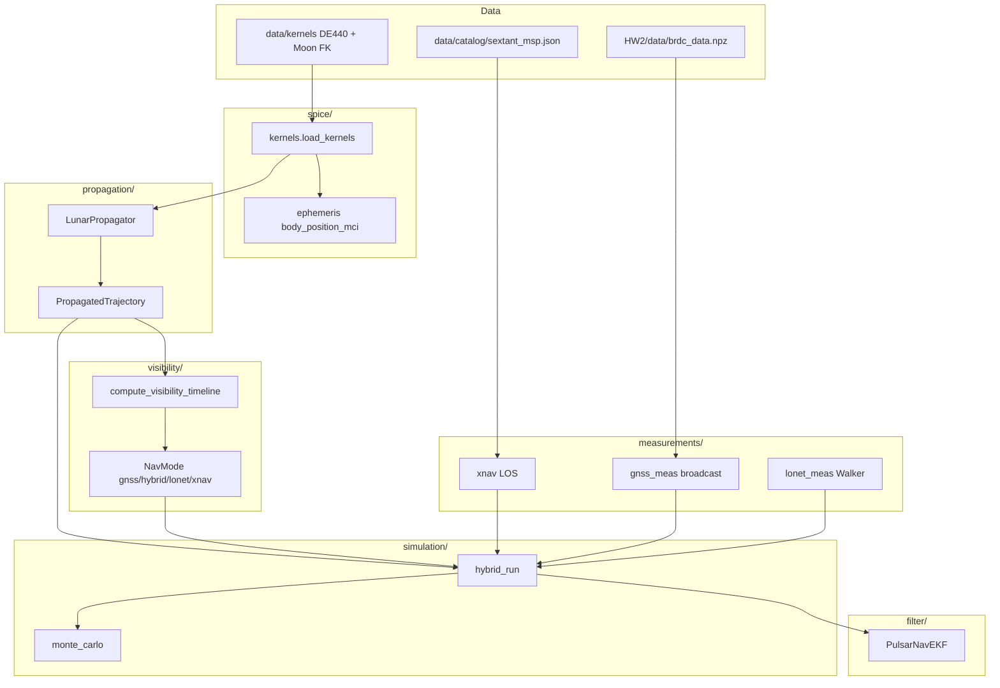

# Repository architecture

Pulsar Hybrid Navigation for the lunar far side (AA278): truth orbit -> visibility -> measurements -> EKF -> Monte Carlo.

---

## End-to-end data flow



---

## State vector and frames

| Quantity | Frame | Units in filter |
|----------|--------|-----------------|
| Truth propagation | MCI (Moon-centered J2000) | km, km/s |
| Truth export for nav | ICRS | m, m/s |
| EKF state **r**, **v** | ICRS | m, m/s |
| Pseudorange geometry | MCI for rho, Jacobian maps to ICRS **r** | m |
| Pulsar LOS | ICRS unit vector n_hat | dimensionless |

**10-state vector** (`filter/state.py`):

```
x = [r_ICRS, v_ICRS, b_rx, b_dot_rx, s_8, s_9]^T
```

- `b_rx`: receiver clock bias (meters)
- `b_dot_rx`: clock drift (m/s)
- `s_8`, `s_9`: spare (unused in measurements)

---

## Mathematics by layer

### Truth dynamics (`propagation/dynamics.py`)

Moon-centered specific force (km/s^2):

```
a = -mu_m * r / norm(r)^3
  + sum over Earth and Sun of indirect terms:
    -mu_b * ( (r - r_b) / norm(r - r_b)^3 + r_b / norm(r_b)^3 )
```

Optional: Moon J2, solar radiation pressure. Integrated with `scipy.integrate.solve_ivp` (`propagator.py`). Earth/Sun positions from SPICE DE440.

**Frames (verified):** Truth integrates in **MCI**; stored **ICRS** uses `r_icrs = r_moon_ssb + r_mci` and `v_icrs = v_moon + v_mci` (`spice/ephemeris.py`). Filter dynamics predict propagates in MCI then maps back with the same formulas (`filter/dynamics_predict.py`). Pseudorange Jacobians use `icrs_position_to_mci_km` at fixed `et` (Moon ephemeris not in **H**). **STM:** 6x6 `Phi` from MCI is applied to ICRS position/velocity errors (Moon translation cancels to first order; matches numeric ICRS propagation within ~5% over 60 s in tests).

**J2 caveat:** `moon_j2_acceleration` uses **MCI/J2000** axes, not Moon principal-axis (MOON_PA). Acceptable for default sim (J2 off); with `--disturbed-dynamics`, compare cautiously to HW2 body-fixed J2 if tight agreement is required.

**Initial state:** HW2 frozen-orbit COE are defined in the Earth orbital-plane (OP) frame. `mci_to_op_rotation` (HW2 P2.3) maps OP -> MCI via block-diagonal rotation built from Earth `r x v` and the lunar pole - not `MOON_PA` `sxform` (see `spice/ephemeris.py`).

**ICRS truth position:**

```
r_ICRS = r_MCI + r_Moon/SSB(t)
```

(Implemented in propagator loop using `moon_position_icrs_km`.)

### XNAV (`measurements/xnav.py`)

Linearized pulsar observable (Sheikh):

```
z_k = n_hat_k dot r + nu_k
sigma_z_k = c * sigma_TOA
```

Jacobian row: `H_k = [n_hat_k^T, 0, 0, ...]`.

### GNSS pseudorange (`measurements/pseudorange.py`)

```
rho = norm(r_rx - r_tx(t_tx)) + b_rx - b_tx
```

Light-time: iterate `t_tx <- t_rx - norm(r_rx - r_tx) / c` (3 times).
Jacobian: `H_rho = [(r_rx - r_tx) / norm(r_rx - r_tx)]^T` (ICRS chain), `H_b_rx = 1`.

GPS `r_tx`: broadcast Keplerian ECEF -> ITRF93 -> J2000 -> + Earth MCI (`ephemeris/gps_posclk.py`).

### EKF (`filter/ekf.py`)

**Predict** modes (`simulation/predict_mode.py`):

| Mode | Mean propagation |
|------|------------------|
| `truth_velocity` | `r <- r + v_truth * dt` |
| `cv` | `r <- r + v_hat * dt` (CV Phi) |
| `dynamics` | MCI RK45 + analytic STM (dPhi/dt = J*Phi); ICRS <-> MCI; HW2-style CWNA Q (sigma_acc km/s^2/sqrt(s)) |

Clock: `b_{k+1} = b_k + b_dot_k * dt` in all modes.

CV:

```
r_{k+1} = r_k + v_k * dt
x_{k+1|k} = Phi * x_{k|k}
P_{k+1|k} = Phi * P_{k|k} * Phi^T + Q
```

**Update** (stacked measurements at one epoch):

```
y = z - h(x)
S = H * P * H^T + R
K = P * H^T * inv(S)
x <- x + K * y
P <- (I - K * H) * P
```

`update_navigation_epoch` stacks XNAV + all pseudoranges in one `(H, R)` (avoids sequential over-weighting). GPS light-time in filter matches truth synthesis (`get_tx_position` callback). Covariance uses the **Joseph form** `P+ = (I-KH)*P*(I-KH)^T + K*R*K^T` for stacked updates. Process noise `Q` uses a simplified diagonal clock block (bias scales with `q_c * dt^2`, no bias-drift cross-term). XNAV rows of `H` do not observe clock states - in XNAV-only segments the clock covariance grows (physically expected).

### Visibility (`visibility/blackout.py`)

- **Blackout (timeline):** `in_blackout = not gnss_earth_visible` - Earth below 5 deg elevation mask. This is a **geometric upper bound** on sidelobe availability (~40-75% on a 6 hr HW2 ELFO at the project epoch), not trackable PRN count.
- **Trackable GPS (filter):** `visible_gps_prns` / `gps_sidelobe_limb_deg`: clear far-side SC->GPS line (not Earth-occulted, GPS farther than Earth), near-limb annulus (~<=4 deg), cap 4 PRNs. Does not model antenna gain or C/N0; HW2 `gnss_measurements.pkl` is the course ground truth when available.
- **LunaNet:** Walker relays at 8000 km; default 16 sats. Lecture anchors ~40-55% GDOP < 6 for small relay sets - validate with MC sweeps or `verify_pipeline.py`.
- **NavMode:** geometric GNSS / relay flags only (can show `lonet` during blackout); **not** what the filter applied.
- **NavPolicy** (`simulation/policy.py`): three phases - `xnav_only`; `gnss_only`; `hybrid` (**non-blackout fuses** GNSS + all MSPs + LunaNet if relay). EKF uses constant **CWNA** `process_noise_accel` (tunable in `MonteCarloConfig`). `HybridRunResult` exposes per-epoch `nis` / `nis_dof` for consistency checks (`scripts/check_nis.py`).
- **PolicySegment / plots:** strip and MC shading use `segment_from_measurements` (actual EKF inputs), not `NavMode`.

---

## Package: `src/pulsar_nav/`

### `constants.py`
Speed of light, MJD constants, default TOA sigma. Used everywhere measurements convert time <-> range.

### `catalog/`
| File | Role | Called by |
|------|------|-----------|
| `pulsar.py` | `Pulsar` dataclass: n_hat from RAJ/DecJ, `z = n_hat dot r`, phase model | xnav, hybrid_run, monte_carlo |
| `psrcat.py` | HTTP PSRCAT + fallback to bundled JSON | `load_catalog()` |
| `__init__.py` | `load_catalog()`, `load_bundled_catalog()` | All nav demos/tests |

**Data:** `data/catalog/sextant_msp.json` - 5 SEXTANT MSPs.

### `frames/icrs.py`
HMS/DMS -> radians; `unit_vector_icrs(raj, decj)`. Called by `Pulsar.unit_vector_icrs`.

### `timing/model.py`
Phase `phi = f_0 * dt + 0.5 * f_1 * dt^2`; TOA residual `delta_t approx (n_hat dot delta_r) / c`. Not on the main EKF path (XNAV uses range directly); for future barycentric TOA.

### `spice/`
| File | Role | Called by |
|------|------|-----------|
| `kernels.py` | Load `naif0012.tls`, `de440.bsp`, Moon PCK/TF; optional Earth frames for GPS | All SPICE demos, propagator, monte_carlo |
| `ephemeris.py` | `str_to_et`, `body_position_mci`, `moon_position_icrs_km`, `mci_to_icrs_position` | dynamics, propagator, pseudorange, visibility, gnss |

### `ephemeris/` (GPS broadcast)
| File | Role | Called by |
|------|------|-----------|
| `paths.py` | Find `brdc_data.npz`, Earth kernel paths | broadcast, kernels |
| `broadcast.py` | Wrap HW2 `Ephemeris` class (Keplerian nav from RINEX) | gps_posclk |
| `gps_posclk.py` | `get_gps_posclk_mci(et, prn)` | gnss_meas, EKF light-time callback |

**External:** `HW2/supplemental/AA278_HW2_ephemeris_utils.py` (loaded dynamically).

### `propagation/`
| File | Role | Called by |
|------|------|-----------|
| `elements.py` | COE <-> Cartesian; Kepler solver | propagator, lonet |
| `dynamics.py` | `acceleration_mci`, `dynamics_ode` for integrator | propagator |
| `propagator.py` | `LunarPropagator`, `PropagatedTrajectory`, ELFO/LLO presets | All truth-based sims |
| `poliastro_backend.py` | Optional poliastro propagator | Not default path |

### `visibility/`
| File | Role | Called by |
|------|------|-----------|
| `geometry.py` | Elevation angle, Moon LOS occultation | gnss, lonet, gnss_meas |
| `gnss.py` | Earth elevation + `gnss_earth_visible` | blackout |
| `lonet.py` | Walker constellation build + propagate in MCI | blackout, hybrid_run |
| `blackout.py` | `compute_visibility_timeline`, `NavMode` | hybrid_run, monte_carlo, demos |
| `celestrak.py` | Optional TLE download | Unused in filter loop |

### `measurements/`
| File | Role | Called by |
|------|------|-----------|
| `xnav.py` | LOS measurement, Jacobian, synthesize, batch LSQ | ekf, hybrid_run, xnav_run |
| `pseudorange.py` | rho model, MCI/ICRS, light-time, Jacobian | ekf, gnss_meas, lonet_meas |
| `gnss_meas.py` | Visible PRNs + synthesize GNSS pseudoranges | hybrid_run |
| `lonet_meas.py` | LunaNet relay pseudoranges | hybrid_run |
| `gnss_sim.py` | Legacy analytic GPS shell | tests only |

### `filter/`
| File | Role | Called by |
|------|------|-----------|
| `state.py` | `NavState`, indices | ekf, all measurements |
| `ekf.py` | `PulsarNavEKF`: predict, XNAV/pseudorange/navigation updates | hybrid_run, xnav_run, demos |

### `simulation/`
| File | Role | Called by |
|------|------|-----------|
| `truth.py` | `TrajectorySample`, helpers | propagator.samples, xnav_run |
| `policy.py` | `NavPolicy` enum | hybrid_run, monte_carlo |
| `xnav_run.py` | XNAV-only EKF on propagated truth | tests, build_presentation_assets |
| `hybrid_run.py` | Mode + policy -> measurements -> `run_hybrid_ekf` | monte_carlo, build_presentation_assets |
| `monte_carlo.py` | Campaigns, sweeps, `PolicyStats` | build_presentation_assets, tests |

### `visualization/`
| File | Role | Called by |
|------|------|-----------|
| `orbit_plots.py` | 3D MCI/ICRS orbits | propagate demos |
| `nav_plots.py` | XNAV error time series | tests |
| `visibility_plots.py` | Blackout timeline | build_presentation_assets |
| `hybrid_plots.py` | Hybrid vs XNAV errors | tests |
| `monte_carlo_plots.py` | Boxplots, pulsar sweep | build_presentation_assets |

---

## Scripts (`scripts/`)

| Script | Purpose |
|--------|---------|
| `build_presentation_assets.py` | Full presentation bundle: geometry, filter_dynamics MC, predict-mode comparison |
| `refresh_presentation_manifest.py` | Regenerate `presentation/INDEX.md` from existing CSVs (no MC) |
| `sweep_process_noise.py` | Q / sigma_acc sweep tables |
| `check_nis.py` | NIS/df diagnostic for filter tuning |
| `verify_pipeline.py` | End-to-end smoke check |

**Typical hybrid/MC call chain:**

```
load_kernels(load_gps_frames=True)
-> LunarPropagator.propagate_preset("elfo")
-> compute_visibility_timeline(traj)
-> run_hybrid_on_propagated / run_monte_carlo
 -> run_hybrid_ekf (per trial)
 -> predict_kinematic
 -> measurements_for_epoch -> gnss_pseudoranges / lonet_pseudoranges / synthesize_measurement
 -> ekf.update_navigation_epoch
```

---

## Tests (`tests/`)

Mirror package modules; require SPICE + often `brdc_data.npz` in `HW2/data/`.

---

## External / vendored

| Path | Role |
|------|------|
| `HW2/` | Course homework: `brdc_data.npz`, gnss CSV, ephemeris utils |
| `poliastro/` | Optional orbit backend (submodule) |
| `figures/` | Demo output PNGs |

---

## Design choices

1. **Truth in ICRS, rho in MCI** - Filter state is ICRS; pseudorange Jacobians account for Moon ephemeris when mapping d(rho)/d(r).
2. **Hybrid policy** - XNAV every epoch; GNSS when not in blackout; LunaNet when `NavMode` allows.
3. **Single stacked update** - All sensors at one epoch share one Kalman gain.
4. **Truth-velocity predict** - Simulation uses truth **v** for time update (stand-in until ODTS in filter matches HW2).
5. **Monte Carlo** - One propagated arc + visibility timeline; randomize initial offset and measurement noise per trial.
